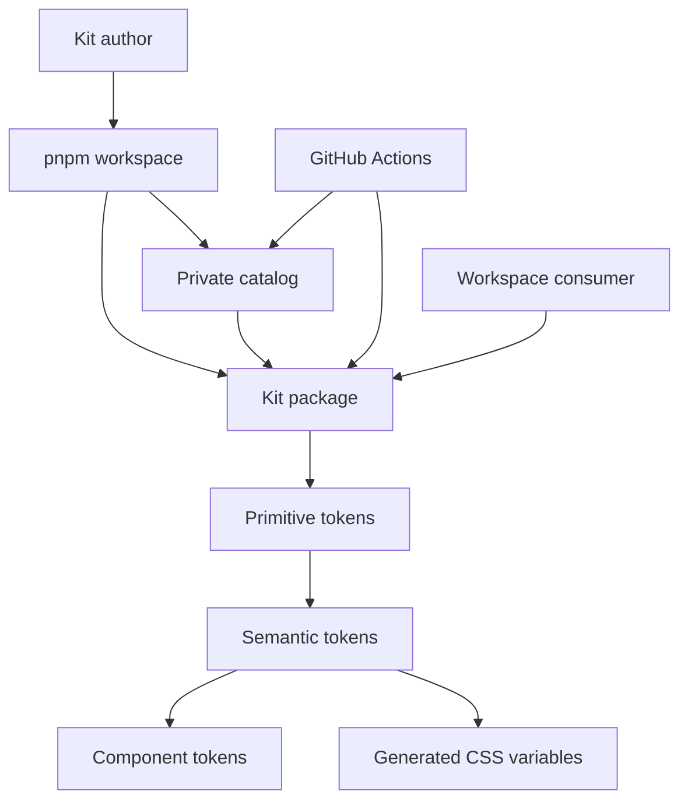

# Ctrl UI Foundation - Plan

The key words "MUST", "MUST NOT", "REQUIRED", "SHALL", "SHALL NOT", "SHOULD", "SHOULD NOT", "RECOMMENDED", "MAY", and "OPTIONAL" in this document are to be interpreted as described in RFC 2119.

## Goal Capsule

**Objective.** Stand up the Ctrl UI workspace and the token pipeline so later atoms inherit lint, test, catalog, and theming gates.

**Product authority.** This file is the unified plan. Product Contract meaning is unchanged from brainstorm. Planning Contract and units below are the HOW.

**This increment.** U1 workspace/build, U5 quality/catalog/CI (split from origin Platform), U2 tokens. No public atoms.

**Stop conditions.** Do not add atoms, molecules, organisms, templates, React Aria, Stylelint, ESLint, Prettier, or npm publish.

**Execution profile.** Greenfield. Smoke-first: U1 is install plus the tsdown build; U5 is lint, format, test wiring, and the catalog skeleton. Token units are feature-bearing with specification-style tests.

**Open blockers.** None for this increment. Package identity is scoped `@ctrl/ui` (Q6). Unscoped `ctrl-ui` stays a third-party registry collision and MUST NOT be the kit name. First npm publish still waits for the first atom batch and for npm-org access to the `@ctrl` scope.

**Product Contract preservation.** Restructured, no scope change: origin Platform is U1 + U5; origin U3 atoms and U4+ layers stay deferred.

---

## How This Work Fits Together

One product: **Ctrl UI**. Infrastructure and the design system are not separate products — a package without a layer model is meaningless, and layers without a toolchain cannot be honestly gated (a11y, lint, versioning).

**This increment (code delivery):**

1. Toolchain and git discipline (so every later layer already lives behind the right gates).
2. Tokens and the CSS-variable contract (primitive → semantic → component-token tiers).

**Later increments of the same product (not this slice):**

3. Atoms with the a11y contract.
4. Molecules.
5. Organisms (modal, table, and similar).
6. Templates / layout shells.

Coverage and Storybook gates (D14, D15) apply to public exports that **exist**. They MUST NOT be used as a reason to create atoms or later layers in this increment.

This increment executes U1, U5, and U2. It MUST NOT change layer, a11y, or customization rules.

---

## Product Contract

### Summary

Ctrl UI is an opinionated React + TypeScript kit. This slice delivers the pnpm workspace, kit package `@ctrl/ui`, catalog Storybook, quality gates, and the token pipeline with light and dark CTRL identity. It does not deliver atoms.

### Primary actors

- **Kit author** — develops Ctrl UI in this repository.
- **Feature consumer** — a product team that installs the package and builds screens. Must not have to assemble keyboard navigation, focus traps, and ARIA for shipped UI modules.

### Positioning

Ctrl UI is an **opinionated design-system kit**, not a headless set and not a copy-paste catalog like shadcn. The consumer gets a finished visual language and accessible behavior. Customization goes through tokens, a closed variant set, and composition — not through unbounded style props.

**First target consumer.** This is a **reference product and hoped-for pilot**, not a signed adoption and not a team that already installs Ctrl UI. It is an **example of who might consume the kit**, not a brand to copy. Do not name the employer or product in this public repository. Their palette MUST NOT become Ctrl UI’s default primitives. Using them as an example MUST NOT assume procurement, a rewrite, or that they will switch.

- **Who:** An unnamed B2B trip-booking product the kit author already works on. Hoped-for pilot only. Internal screens stay out of this repo.
- **What they ship:** Corporate travel booking and trip management: search and book air/hotel/car and related legs, company and user profiles, dense policy admin, dashboards, checkout/payment, agent and traveler on one platform, partner white-label. Typical surfaces: flight search, admin tables and forms, profiles, charts, schematic maps, seat maps, itineraries, checkout, AI chat.
- **Why Ctrl UI:** The live app mixes two kits (a nearly deprecated one and a newer Material UI–based one). Folder structure is loose, dead code accumulates, and accessibility is layered on top of MUI instead of owned. The UI looks inconsistent. A third iteration is desired: strict Atomic Design, a real token system, light and understandable. Ctrl UI could fit because it is Atomic by contract, a11y is kit-owned, and semantic tokens support white-label theming without forking. This MUST NOT be read as “they will adopt Ctrl UI”.
- **Example UI (not Q2 default):** A marketing look with a coral-red brand, a separate wine hue, cool greys, and a link blue. Use as a **theme proof** only. Do not copy those brand colors into Ctrl UI’s default theme. Do not add internal product screenshots.

Adjacent product shapes we are not building:

- Headless-only (Radix/React Aria as the product) — maximum freedom, no system. React Aria is an implementation dependency for later composite layers, not the product.
- Utility-first kit with Tailwind as the public API — consumers bypass tokens.
- Source-copy kit — breaks Conventional Commits / semver as the delivery contract.
- A Next.js / App Router kit as a separate package.

### Core outcome

**Standing product outcome.** A feature consumer can install the kit, theme it through semantic tokens, and assemble screens from public UI modules without breaking kit-owned a11y. Visual hierarchy is enforced through tokens, closed variants, and composition. `className` / slot class is a documented last-resort appearance hatch: it MUST NOT strip `role`, the `:focus-visible` contract, or keyboard behavior. Channel 4 is not a promise that visual hierarchy is unbreakable.

**This increment’s validation.** This foundation validates **kit-author catalog composition** (token pipeline, theme switch in Storybook, toolchain gates). A consumer-shaped “assemble a screen” flow is out of validation until a consuming app exists. Isolated Default stories and a catalog theme switch MUST NOT be treated as proof of that standing outcome.

### Language (repo artifacts)

All documents, plans, READMEs, Storybook docs, JSDoc, inline comments, commit messages, and pull request text in this repository are **English only**. Chat with humans may use another language; committed work must not. Standing instruction for agents: `AGENTS.md` and the single-responsibility files in `.cursor/rules/`. R13/D13 cover **repo prose**, not UI copy (see i18n).

### In scope

**This increment (U1–U2):**

- Infrastructure contract: package manager, library build, docs/catalog, lint/format, git hooks, conventional commits, versioning.
- Token pipeline: primitive → semantic → component tokens, CSS custom properties, locked semantic inventory (including success/warning/info), light and dark schemes, WCAG 2.2 AA contrast on painted pairs.
- Atomic Design as the primary architecture (folders, dependency direction, and rules), even while later layers have no public UI modules yet.
- Storybook gallery stories for each public token collection.
- Vitest with a strict 100% coverage gate on kit source (domain below).
- English-only committed prose.
- RFC 2119 keyword language in every future implementation plan.
- Workspace package `@ctrl/ui` that a consumer can install without cloning this repository; semantic tokens apply after install. npm publish waits for the first atom batch.
- Token/CSS modules that ordinary React and RSC hosts can import without a Next-specific package.
- Direction tokens, a `dir` contract, and logical CSS so RTL layout is encoded in this increment. Typography tokens name Inter.

**Standing product (later increments, same kit):**

- Atoms, then molecules, then organisms, then templates, with downward-only dependencies.
- WCAG 2.2 AA as the floor for every public UI module.
- Customization contract (four channels).
- Full Storybook coverage of every public UI-module export (Default, each public variant, each required public state).
- Native HTML + APG for atoms; React Aria for molecules and organisms when those layers exist.
- String overrides for kit copy; RTL layout behavior on public UI modules (direction tokens already exist in this increment).
- `"use client"` on published modules that use client APIs.

### Out of scope

**Permanent (not this product):**

- Native iOS/Android kit.
- A Figma library as a required first-delivery artifact.
- Marketing site, changelog portal, paid product.
- Copying another visual language (MUI, Chakra, shadcn).
- An App Router / Next-specific framework kit as a separate package.
- A full localization platform (ICU catalogs, translation pipelines).
- Visual regression / screenshot tests (desirable later; not a foundation gate).

**Deferred (same product, not this increment):**

- Atoms, molecules, organisms, and templates as code.
- React Aria as a dependency (add it when the first composite UI module lands).
- String-override API (lands with the first atom that ships copy).
- `"use client"` directives (land with the first client atom).

### Customization vs strictness

Customization is allowed only through four channels, in this priority:

1. **Semantic tokens / theme** — the primary channel (role color, density, radius, typography, light/dark scheme).
2. **Closed variant props** (`intent`, `size`, `appearance`) — finite enums, not free-form style strings.
3. **Composition** — compound modules and slots for structure, not for replacing semantics.
4. **Escape hatch** — `className` / slot class on documented nodes, last resort. MUST NOT strip `role`, `:focus-visible`, or keyboard behavior. This is an appearance hatch, not an unbreakable hierarchy promise.

Forbidden as public API:

- Props such as `backgroundColor`, `sx`, or an arbitrary CSS-in-JS theme object as the main path.
- Turning off semantics and keyboard behavior “to make styling easier”.
- Direct use of primitive tokens in UI modules and by consumers (semantic / component tokens only).

Kit-author strictness:

- A UI module contains no literal colors, spacing, or type values outside the token pipeline.
- A one-off visual prop is not added; add a token or a variant first.
- Atomic Design layers do not import upward.
- In token context, the third tier is **component tokens**. UI modules are **atoms / molecules / organisms / templates**, never “components” when that token tier is in scope.

### Accessibility floor

**This increment (tokens).** No ARIA library. Tokens encode contrast, the focus-ring contract, minimum 24×24 CSS px target size, and `prefers-reduced-motion`.

**Later — atoms.** Native HTML (`button`, `a`, `input`, and the matching elements) plus APG. Do not wrap those primitives in a headless layer to ship Button and peers.

**Later — molecules and organisms.** **React Aria** (not Radix, not a from-scratch composite). Ctrl UI owns visuals and tokens. Do not add React Aria until the first composite lands. Do not mix React Aria and Radix.

Every public UI module (when it exists):

- Meets WCAG 2.2 AA, including Target Size 2.5.8 (minimum 24×24 CSS px) and Focus Not Obscured 2.4.12.
- Keyboard: Tab/Arrow/Enter/Space/Escape per APG for that pattern.
- Has a visible `:focus-visible` indicator.
- Icon-only controls have an accessible name.
- Form errors are announced with `role="alert"` / `aria-live`, not color alone.
- Overlays: focus trap, focus return, `Escape` (via React Aria when that layer exists).
- Automated a11y checks in the catalog and in tests are required; a manual keyboard pass is part of Definition of Done for overlay and composite widgets.

A consumer may **add** ARIA, but cannot strip the contract the kit owns.

### Internationalization

Consumers MUST be able to override kit strings. Layout MUST support RTL.

This increment MUST ship direction tokens, a document `dir` contract (`ltr` | `rtl`), and logical CSS properties for any directional inset or space. String overrides land with the first atom that ships copy. A full localization platform is out of scope. Public UI modules (later) MUST honor `dir` without a fork.

R13/D13 (English-only) apply to repository prose, not to runtime UI copy.

### React hosts

The kit MUST work in ordinary React 18 and React 19. RSC hosts MUST be able to import it without a Next-specific package. Published modules that use client APIs MUST be marked `"use client"`. Kit `peerDependencies` for `react` and `react-dom` MUST be `^18.0.0 || ^19.0.0`.

This increment MAY ship CSS/token modules that are RSC-safe. `"use client"` lands with the first client atom.

### Quality toolchain (product constraints)

These decisions are product constraints. Concrete files and versions are in the Planning Contract.

| Concern | Decision | Why |
| --- | --- | --- |
| Language | React 18–19 + TypeScript, `strict` | session-settled |
| Package manager | **pnpm** + Corepack | kit/workspace default; predictable lockfile invariants |
| Repo shape | **pnpm workspace with two surfaces**: public kit package and internal catalog/docs app | catalog must not ship in the npm artifact; full Turborepo on day one is extra ceremony |
| Library bundler | **tsdown** (Rolldown, ESM-first, dts) | tsup successor; Vite stays for the catalog, not for publish |
| Catalog | **Storybook on Vite; every public export has CSF3 stories** | session-settled “fully storybooked” |
| Tests | **Vitest + Testing Library + axe** | oxlint has Vitest rules; Jest is unnecessary |
| Coverage | **100% statements, branches, functions, lines; `perFile: true`** on kit source (domain below) | session-settled; Vitest `coverage.thresholds['100']`; istanbul recommended |
| Lint | **oxlint only** for JS/TS/TSX | session-settled; ESLint is not introduced |
| Format | **oxfmt**, not Prettier and not oxlint | oxlint is not a formatter; oxfmt is the Prettier-compatible Oxc replacement |
| CSS lint | **no Stylelint at foundation** | oxlint does not lint CSS; keep Stylelint YAGNI by shrinking the CSS surface (see investigation below) |
| Git hooks | **Lefthook** | one runner: staged oxlint/oxfmt + commit-msg |
| Commits | **Conventional Commits** via commitlint | session-settled |
| Versioning | **Changesets** + semver | library changelog quality beats auto-bump from commit type; conventional commits remain history discipline |
| Node | **Node 22** (Maintenance LTS; `engines` MUST be `>=22.18.0` for tsdown and oxlint TS config) | |
| Package module | **ESM-only** | CJS dual-publish only if a real consumer is blocked |
| Styles | Tokens → CSS custom properties; UI-module styles live in TypeScript, not a large SCSS codebase | so oxlint covers style code and oxfmt formats the rare CSS dump |
| Repo language | **English only** for documents, plans, READMEs, Storybook docs, JSDoc, inline comments, commit messages, and pull request text | session-settled |

### Semantic token inventory

Foundation semantic roles:

- Color: `surface`, `on-surface`, `action`, `on-action`, `danger`, `on-danger`, `success`, `on-success`, `warning`, `on-warning`, `info`, `on-info`, `focus`
- Plus: space, radius, typography (Inter), density, direction (`ltr` | `rtl`), minimum 24×24 target size, prefers-reduced-motion
- Schemes: **light and dark** in the first token drop
- Token galleries MUST show light and dark side by side

Each painted foreground/background pair MUST meet WCAG 2.2 AA contrast. Primitive tokens stay private. UI modules and consumers use semantic or component tokens only.

### Ctrl UI visual language (Q2)

Source: the CTRL wordmark and two-circle lockup (black disk, white glint, satellite dot) on cool paper. This is Ctrl UI’s identity, not the unnamed reference product.

- **Ink:** `#000000`. **Paper:** cool off-white near `#F2F2F2`. **Glint:** `#FFFFFF`.
- **Action** on light is ink; **on-action** is paper or white. Dark scheme inverts: surfaces near ink, action is paper/white, on-action is ink.
- **Radius** is generous (the mark is circular). Semantic steps in U2: `sm`, `md`, `lg`, `full` (directional defaults 8 / 12 / 16 CSS px and a pill). Exact px MAY be tuned in U2 if the family stays distinct and circular-generous. The CTRL lockup is brand, not UI body type. UI type is **Inter**. Tokens MUST name family Inter. Catalog MUST load Inter via `@fontsource/inter` for weights 400, 500, 600, and 700. Kit `--font-family` MUST be `Inter, system-ui, sans-serif`. Do not assume Inter is installed on the OS. Semantic type sizes MAY be tuned in U2; directional defaults: `sm` 14 / `md` 16 / `lg` 20 / `xl` 24 CSS px.
- **Density** steps in U2: `compact`, `comfortable`, `spacious` (directional space multipliers 0.75 / 1 / 1.25). Exact multipliers MAY be tuned in U2.
- **Status hues** (`success`, `warning`, `info`, `danger`) are muted professional ramps, distinct from action (action is ink, not a chromatic brand red). U2 generates 50–900 steps from those families. Exact status hex MAY be tuned in U2 as long as AA holds and the ramps stay distinct.
- **Focus** is a visible ring that meets 2.4.12; it MUST NOT rely on color alone. U2 ships ring width 2 CSS px and offset 2 CSS px using the `focus` color as outline, not fill. Exact width/offset MAY be tuned if 2.4.12 still holds on `surface` and `action` in both schemes.

An unnamed reference product’s palette MAY be used later as a **theme proof**. It MUST NOT be copied into the default theme.

### Primitive color scales

Primitive color ramps SHOULD use a stepped scale **50–900** (MUI-like steps: 50, 100, …, 900). Each ramp is one hue family. UI modules MUST NOT consume these steps; semantic roles point at a step.

**Accent steps A100–A700 are not required.** Material Design 3 dropped them. Add an accent scale only if a later increment has a real use (for example data-viz highlights). Do not invent unused A-tokens in U2.

A white-label product whose brand is already a red needs **several ramps**, not one 50–900 object that mixes unrelated hues. Coral-red, wine (a different hue, not red.900), cool grey, and link blue are four families. Brand-red as `action` also collides with `danger`; a theme proof MUST map those to distinct ramps.

Ctrl UI MUST NOT ship a named employer theme with their brand colors. Theme proof is a mapping exercise, not a published skin.

### Test descriptions

Proven convention locked for this repo (Vitest testing-in-practice: titles describe behavior and read as a spec; BDD `describe` grouping; drop the redundant `should` prefix):

```ts
describe('Button', () => {
  describe('when loading is true', () => {
    it('exposes a busy state and ignores press', () => {});
  });
});
```

Use `describe` + `it`. Name the unit, then the condition, then the observable outcome. One behavior per `it`. Arrange–Act–Assert in the body. Colocate `*.test.tsx` with source.

### Coverage domain (R14)

Kit source for the 100% gate is **author-written `.ts` / `.tsx` in the public kit package**.

Exclude: `*.stories.*`, type-only files, generated token output, and re-export barrels.

Those exclusions MUST NOT hide author-written kit source. A file is not “covered” by existing only as a story. Catalog-app scaffolding that is not published is also out of the gate.

### Storybook completeness

Every public export is catalogued. Story titles follow Atomic Design (`Atoms/Button`, `Tokens/Color`). Autodocs and the a11y addon are on.

**UI modules** (atoms and up, when they exist): Default, each public variant, and each required public state. A public UI module without those stories MUST NOT merge.

**Token collections:** one gallery story per public token collection (`Tokens/Color`, `Tokens/Space`, `Tokens/Typography`, `Tokens/Radius`, `Tokens/Density`, `Tokens/Direction`, and peers). A token public export is a **collection module**, not an individual token constant. Do not invent Default/variant/state stories per constant. Each gallery MUST show light and dark values side by side in the same story. The catalog scheme toolbar MAY remain as an extra control; it MUST NOT be the only way to compare schemes.

### Public state contract (atoms, later increment)

Interactive atoms, when they exist, expose:

- Default
- hover
- focus-visible
- pressed
- disabled
- loading/busy when the control can wait
- invalid when the atom is form-capable

Hover and pressed are required public states, not CSS-only extras. Each required state MUST have a CSF3 story and a specification-style test.

The first atom’s public prop-and-token contract stays revisable until the first npm publish. This increment (U1–U2) is a **workspace / private package**. npm publish waits until the first batch of atoms is ready. Semver majors apply from that first npm publish. Identity (Q2) is already settled.

### Implementation-plan language

`ce-plan` and any later implementation plan MUST interpret and write requirements with RFC 2119 keywords (MUST / MUST NOT / SHOULD / MAY, and equivalents). The RFC 2119 key-words sentence MUST appear near the top of that plan.

### Oxlint / Prettier / Stylelint investigation

Facts as of August 2026 (Oxc docs + compatibility matrix):

- **Oxlint** is a JS/TS/JSX/TSX linter (plus script blocks in Vue/Svelte/Astro). It replaces ESLint. CSS/SCSS/HTML/Markdown are **out of linting scope**.
- **Oxfmt** is a separate formatter in the same line. It formats JS/TS and also CSS, SCSS, Less, JSON, YAML, Markdown, HTML, and more. It replaces Prettier; it is not part of oxlint.
- **Stylelint** is not replaced by oxlint. Oxfmt covers CSS *formatting*, not CSS *quality rules* (unknown properties, specificity discipline, bans on literals).

Consequence for Ctrl UI:

1. Do not add Prettier — use **oxfmt**.
2. Do not add ESLint — use **oxlint** (including jsx-a11y / React rules oxlint already ships).
3. Do not add Stylelint until there is a hand-written CSS codebase. Tokens compile to CSS variables; UI modules are styled so most style code is TypeScript. If substantial hand-written CSS appears later — then a narrow Stylelint, not “just in case”.

### Requirements

**This increment**

- **R1.** A kit author can clone the repository, enable Corepack, and get hooks, lint, format, typecheck, test, and catalog from one dependency install.
- **R2.** A commit with a non-conventional message is rejected locally (commit-msg hook) and in CI.
- **R3.** Staged JS/TS passes oxlint and oxfmt before it enters git; CI repeats the full check.
- **R4.** The public package does not contain catalog, tests, or toolchain configs as runtime dependencies.
- **R5.** Tokens are the only source of visual decisions. Primitives do not leak into the public API. Semantic inventory and AA contrast on painted pairs are as specified above.
- **R6.** Atomic Design is the primary architecture and is followed strictly. Every public module lives in exactly one layer. Layers depend only downward. A layer violation is a defect and MUST NOT merge.
- **R8.** Theme switches without forking UI modules (semantic layer / CSS variables).
- **R13.** All committed documents, plans, READMEs, Storybook docs, JSDoc, inline comments, commit messages, and pull request text are English.
- **R14.** Author-written `.ts` / `.tsx` in the public kit package MUST meet Vitest coverage of 100% statements, branches, functions, and lines, globally and per file. Exclude `*.stories.*`, type-only files, generated token output, and re-export barrels. CI MUST fail otherwise.
- **R15.** Every public export MUST have Storybook stories. Token collections MUST have one gallery story per collection module. A public UI module without the required story matrix MUST NOT merge.
- **R16.** Test titles MUST follow the specification-style convention in `.cursor/rules/tests.mdc` (`describe` + `it`, no “should” prefix, behavior not implementation).
- **R17.** Every implementation plan MUST use RFC 2119 keywords and include the RFC 2119 key-words sentence.
- **R18.** A feature consumer can install the public (or workspace) package `@ctrl/ui`, satisfy the React 18–19 peer, and apply semantic tokens without cloning this repository.
- **R19.** The kit works in ordinary React 18 and React 19. RSC hosts can import it without a Next-specific package. Token/CSS modules in this increment are RSC-safe.

**Standing (when the relevant layer exists)**

- **R7.** Every public UI module has: a TypeScript prop contract, CSF3 stories for Default, each public variant, and each required public state, plus an a11y check.
- **R9.** A feature consumer customizes appearance only through channels 1–4 above. Breaking semantics through the public API is impossible or rejected by types. `className` MUST NOT strip `role`, `:focus-visible`, or keyboard behavior.
- **R10.** Overlay and composite widgets (when they exist) ship their own focus management and keyboard behavior via React Aria; Ctrl UI owns the visual layer.
- **R11.** Package version and changelog are driven by Changesets; a public API breaking change is a major from the first npm publish.
- **R12.** Public UI-module docs describe: purpose, variants, tokens, and what must not be overridden.
- **R20.** Consumers can override kit strings. Layout supports RTL.
- **R21.** Published modules that use client APIs are marked `"use client"`.
- **R22.** A feature consumer can import a public atom from the installed package (not only from this repo).
- **R23.** Interactive atoms expose the public state matrix (Default, hover, focus-visible, pressed, disabled, loading/busy when waiting, invalid when form-capable), each with a story and a specification-style test.

### Primary flows

1. **Bootstrap.** Author installs dependencies → hooks are active → `lint` / `fmt:check` / `typecheck` / `test` / `catalog` work on the empty skeleton.
2. **Add a token.** Author adds a primitive and a semantic mapping → CSS variables update → no UI module is edited by hand to change a color role.
3. **Add an atom (later increment).** Author builds the atom on tokens → story + a11y test → changeset → conventional commit. The consumer sees closed variants and theme, not internal primitives.
4. **Theme in the catalog (this increment’s consumer-shaped check).** Author (or a workspace consumer) installs the package, sets semantic tokens (or picks a shipped theme), and confirms roles update in token gallery stories. A full product screen is out of validation until a consuming app exists.
5. **Release (this increment).** Changeset on the PR → CI green → private version bump + changelog. Do not publish.
6. **Release (later, after the first atom batch).** Publish `@ctrl/ui` to npm. First publish requires access to the npm `@ctrl` organization.

### Acceptance examples

- A consumer changes `--color-action` (and matching `--color-on-action`) — all primary actions and matching states follow it. Source of public UI modules is untouched.
- An icon-only `Button` without an accessible name fails the a11y test and/or a type-level ban (later increment).
- `className` on the root changes the outer wrapper but does not remove `role`, the focus-ring contract, or the keyboard handler (later increment).
- Commit `fixed button` is rejected; `fix(button): restore focus ring on dark theme` is accepted.
- The published tarball does not contain `apps/catalog` or toolchain `node_modules`.
- A new plan, comment, or JSDoc committed in a non-English language is rejected in review (and later by lint/CI if such a gate exists).
- CI fails if any included kit source file is below 100% statements, branches, functions, or lines.
- A new public `Button` variant without a story and without an `it('…')` for that state cannot merge (later increment).
- Token collections appear in Storybook as galleries (`Tokens/Color`, and peers), not as one story file per constant.
- A workspace or published install can import token CSS/variables without cloning this repository.
- This increment can be declared done without a consumer-assembled screen.

### Non-goals

- A universal CSS framework.
- Vue / Svelte / React Native support in this product.
- A pixel-perfect copy of an existing library or of the example product’s brand palette.
- “Any customization at any cost”.
- Declaring the standing consumer-screen outcome proven by catalog stories alone.

### Key decisions

- **D1.** React + TypeScript. `session-settled: user-stated`
- **D2.** Atomic Design is the primary architecture and MUST be followed strictly (tokens → atoms → molecules → organisms → templates; sub-atoms = tokens). `session-settled: user-stated`
- **D3.** Conventional Commits + git hooks. `session-settled: user-stated`
- **D4.** ESLint is not used; JS/TS lint = oxlint. `session-settled: user-stated`
- **D5.** Prettier is not used; format = oxfmt (not oxlint). `session-settled: investigated-from-user-intent`
- **D6.** Stylelint is not introduced at foundation; CSS surface is deliberately small. Revisit if hand-written CSS appears. `session-settled: investigated-from-user-intent`
- **D7.** The product is an opinionated kit, not headless and not copy-paste. `recommended default`
- **D8.** Customization: tokens → variants → composition → className last resort. `className` MUST NOT strip role, focus-visible, or keyboard. `session-settled: user-stated`
- **D9.** pnpm + tsdown + Storybook/Vite + Vitest + Lefthook + commitlint + Changesets. `recommended default`
- **D10.** ESM-only, Node 22, React 18–19 as peer (`^18.0.0 || ^19.0.0` for `react` and `react-dom`). `session-settled: user-stated`
- **D11.** WCAG 2.2 AA is the floor, not a later goal. `session-settled: user-stated` (AA level is the recommended default)
- **D12.** Hybrid a11y: native HTML + APG for atoms; React Aria for molecules and organisms when those layers exist; Ctrl UI owns visuals and tokens. Do not add React Aria until the first composite. Do not use Radix. `session-settled: user-stated`
- **D13.** All repository documents, plans, READMEs, Storybook docs, JSDoc, inline comments, commit messages, and pull request text are English only. `session-settled: user-stated`
- **D14.** Vitest with strict 100% coverage in all four categories, per file, on the coverage domain in R14. Istanbul is the recommended provider. `session-settled: user-stated`
- **D15.** The kit is fully Storybooked: UI modules use the Default/variant/state matrix; token collections use one gallery story per collection module. Token galleries MUST show light and dark side by side. `session-settled: user-stated`
- **D16.** Test descriptions use specification-style `describe`/`it` titles (Vitest testing-in-practice + BDD grouping; no “should” prefix). `session-settled: investigated-from-user-intent`
- **D17.** Future implementation plans use RFC 2119 requirement keywords. `session-settled: user-stated`
- **D18.** Standing agent rules are single-responsibility files in `.cursor/rules/` (product shape, layers, tokens, customization, accessibility, toolchain, tests, Storybook, implementation plans, English). `session-settled: user-stated`
- **D19.** This increment is toolchain + tokens only. Atoms and later layers are the same product, later slices. D14/D15 gate exports that exist; they do not create later layers. `session-settled: user-stated`
- **D20.** Ctrl UI identity is the CTRL monochrome lockup (ink `#000000` on cool paper near `#F2F2F2`, white glint). An unnamed reference product is a theme proof, not a palette to copy. `session-settled: user-stated`
- **D21.** Foundation semantic inventory: surface, on-surface, action, on-action, danger, on-danger, success, on-success, warning, on-warning, info, on-info, focus; plus space, radius, typography (Inter), density, direction (`ltr` | `rtl`), minimum 24×24 target size, and prefers-reduced-motion. Light and dark schemes in U2. Painted pairs meet AA. Primitives stay private. `session-settled: user-stated`
- **D22.** This foundation validates kit-author catalog composition. A consumer-shaped screen is out of validation until a consuming app exists. `session-settled: user-stated`
- **D23.** First atom public API stays revisable until first npm publish. U1–U2 ship as a workspace package. npm publish waits for the first atom batch. Semver majors start at that publish. `session-settled: user-stated`
- **D24.** Third token tier is **component tokens**. UI modules are atoms, molecules, organisms, and templates — not “components” in token context. `session-settled: user-stated`
- **D25.** Consumers can override kit strings; layout supports RTL. This increment MUST ship direction tokens, a `dir` contract, and logical CSS. String-override API waits for the first atom that ships copy. `session-settled: user-stated`
- **D26.** Ordinary React 18 and React 19 are the hosts. No Next-specific package. Client modules are marked `"use client"` when they use client APIs. `session-settled: user-stated`
- **D27.** A feature consumer can install the package without cloning this repository. Import of a public atom is a standing requirement when atoms exist. `session-settled: user-stated`
- **D28.** Primitive color ramps use stepped 50–900 scales. Accent A100–A700 are not required in U2. Public API stays semantic. An example brand is a theme proof, not the default ramp. `session-settled: user-stated`
- **D29.** Public package name is `@ctrl/ui`. Workspace directory remains `packages/ctrl-ui`. Unscoped `ctrl-ui` is a third-party registry package and MUST NOT be the kit name. `session-settled: user-stated` (overrides the earlier unscoped `ctrl-ui` lock; chosen over keeping that name or waiting to obtain it)
- **D30.** Light and dark schemes ship in the U2 token drop. Token galleries MUST show both schemes side by side. `session-settled: user-stated`
- **D31.** UI typeface is Inter. Tokens MUST name family Inter. Catalog MUST load Inter via `@fontsource/inter` for weights 400, 500, 600, and 700. Kit `--font-family` MUST be `Inter, system-ui, sans-serif`. Do not assume OS-installed Inter. Semantic type sizes MAY be tuned in U2; directional defaults: `sm` 14 / `md` 16 / `lg` 20 / `xl` 24 CSS px. `session-settled: user-stated` (family); weights and size steps are recommended defaults so U2 is implementable.

### Assumptions

- **A1.** The repository is public MIT. The public package name is `@ctrl/ui`. First npm publish waits for the first atom batch; U1–U2 are workspace-only. The npm organization `@ctrl` already publishes unrelated packages (for example `@ctrl/tinycolor`). Package `@ctrl/ui` was unpublished (HTTP 404) at plan time. First npm publish MUST use an org the author controls for `@ctrl`, or publish will fail. That does not block U1–U2 (`private: true`).
- **A2.** There is no first consuming app in production yet. The first target consumer is a reference product / hoped-for pilot, not a current installer, not a committed rewrite, and not a brand whose palette is copied into Ctrl UI.
- **A3.** Storybook is enough documentation catalog; a marketing docs site is not needed in the foundation.
- **A4.** A full localization platform is not built now. String overrides and RTL are requirements (D25), not this assumption.
- **A5.** Visual regression (screenshot tests) is desirable later; foundation is a11y + unit + story states. Coverage 100% is not visual correctness.
- **A6.** The brainstorm ran in a non-interactive Cloud Agent mode: product forks the user did not lock are recorded as recommended defaults, not as silently “already agreed”.

### Outstanding questions

- **Q1.** Answered: workspace package until the first atom batch; then npm as `@ctrl/ui`. See D23, D29.
- **Q2.** Answered: CTRL monochrome lockup. See D20.
- **Q3.** Answered: light and dark in U2. See D30.
- **Q4.** Answered: `@ctrl/ui`. See D29.
- **Q5.** Answered: `success`, `warning`, `info` (and on-* pairs) are in the inventory. See D21.
- **Q6.** Answered: scoped npm name `@ctrl/ui`. Unscoped `ctrl-ui@0.0.8` is unrelated and MUST NOT be the kit name. See D29, KTD5.
- **Q7.** Answered: Inter, shipped via `@fontsource/inter` (weights 400, 500, 600, 700). See D31.
- Q8. Deferred: token gallery information architecture (grouping, painted-pair layout) beyond “one gallery per collection” and the locked side-by-side light/dark rule.
- **Q9.** Answered: React peer range is `^18.0.0 || ^19.0.0`. See D10, D26.
- **Q10.** Answered: U2 MUST ship direction tokens, a `dir` contract, and logical CSS now. String overrides still wait for the first atom with copy. See D25.
- **Q11.** Answered: token galleries MUST show light and dark side by side. The scheme toolbar MAY remain as an extra control. See D15, D30.

U1, U5, and U2 MAY be planned now. U2 MUST ship Ctrl identity (ink/paper) plus light and dark. It MUST NOT copy the unnamed reference product’s palette into the default theme.

### Approaches considered

Three product shapes. Recommendation: Approach A.

**Approach A — Token-strict Atomic kit (recommended).**  
Layers, tokens, closed variants, a11y in the API. The consumer gets a system. Risk: slower to “throw a button together”. Fits because the user wants a system, not a widget bag.

**Approach B — Headless primitives + optional theme.**  
Maximum customization, weak visual discipline; the kit easily becomes a Radix or React Aria wrapper as the product. Rejected: breaks the strictness balance. React Aria remains an implementation dependency for later composites only.

**Approach C — Copy-paste source kit.**  
UI modules live in the consumer repo. Rejected: conflicts with versioning/changelog as a product contract.

Infrastructure challenger: Vite+ as a unified oxlint+oxfmt orchestrator. Rejected for the foundation — separate oxlint/oxfmt CLIs are simpler for a library; the catalog already uses Vite. Revisit if toolchain commands proliferate.

### Success criteria

**This increment**

- A new author completes the Bootstrap flow without hand-configuring hooks.
- Adding a role color does not require UI-module edits.
- Token galleries in Storybook show the locked semantic inventory, with light and dark side by side, Inter loaded, and a direction (`ltr` | `rtl`) control.
- Consumer theming of semantic roles does not require a fork or a repo clone.
- Git history is readable conventional commits; a release has a Changeset changelog when publishing is in scope.
- No non-English documents, comments, commit messages, or pull request text land in the repository.
- Coverage report is 100% statements, branches, functions, and lines on every included kit source file.
- Every public token collection appears in Storybook under an Atomic Design title.

**Standing (later increments)**

- A public atom cannot be used so that the automated a11y scanner and keyboard smoke fail on the default story.
- A feature consumer can theme Ctrl UI to a reference-like palette without forking (unnamed product as proof, not as default). The shipped default is the CTRL monochrome identity.
- Interactive atoms expose the locked state matrix with stories and tests.

---

## Planning Contract

### Key Technical Decisions

- KTD1. The repo is a pnpm workspace with two surfaces: the public kit package and a private catalog app. Catalog MUST depend on the kit via `workspace:*`. Catalog MUST NOT ship in the kit tarball. Chosen over a single-package repo because R4 forbids catalog and toolchain as runtime kit contents. Instantiates D9. Governs R4, R18.
- KTD2. Pin **pnpm 11** via Corepack `packageManager`. Do not pin pnpm 12 (RC as of this plan). Put pnpm policy in `pnpm-workspace.yaml`. `allowBuilds` MUST start with `{ lefthook: true }`. U1/U5 MUST commit the full map required for a strict pnpm 11 CI install after first install (any toolchain package whose lifecycle script is required; commonly `esbuild` when Vite/Storybook is present). `{ lefthook: true }` is the starting entry, not the complete set. Do not use removed `onlyBuiltDependencies`. Instantiates D9. Governs R1.
- KTD3. Kit and workspace `engines.node` MUST be `>=22.18.0`. Node 22 is Maintenance LTS. 22.18 is the floor for tsdown and oxlint TypeScript config. Instantiates D10. Governs R1.
- KTD4. Bundle the kit with **tsdown** (ESM-first, dts). Vite is catalog-only. Do not use Vite or tsup as the library bundler. Instantiates D9. Governs R4, R18, R19.
- KTD5. Kit `package.json` `name` is `@ctrl/ui`. Workspace folder remains `packages/ctrl-ui`. This increment sets `"private": true`. Do not run `changeset publish` or `npm publish`. Unscoped `ctrl-ui@0.0.8` (Brent Jackson, 2018) is unrelated and MUST NOT be the kit name. Package `@ctrl/ui` was HTTP 404 at plan time. The npm org `@ctrl` already publishes unrelated packages (for example `@ctrl/tinycolor`). First later publish requires org access the author controls. (session-settled: user-directed — chosen over keeping unscoped `ctrl-ui` or waiting to obtain that registry name.) Instantiates D23, D29. Governs R11, R18.
- KTD6. Vitest 4 with provider **istanbul**. `coverage.include` MUST list author-written kit `.ts` / `.tsx`. `coverage.all` is gone in Vitest 4. Thresholds MUST use `100: true` and `perFile: true`. Exclude `*.stories.*`, type-only files, generated token CSS, and re-export barrels. Instantiates D14. Governs R14, R16.
- KTD7. Catalog is Storybook **10** on Vite, CSF3, `@storybook/addon-a11y`, Autodocs via `tags: ['autodocs']`. Token public exports get one gallery story per collection. Each gallery MUST render light and dark side by side. Catalog MUST load Inter via `@fontsource/inter` (weights 400, 500, 600, 700). Catalog MUST set `dir` from a direction toolbar (`ltr` | `rtl`) on the story root. Instantiates D15, D25, D31. Governs R15, R20.
- KTD8. oxlint `plugins` **replaces** default plugins. The config MUST re-list `eslint`, `typescript`, `unicorn`, and `oxc`, then add `react`, `jsx-a11y`, `vitest`, and `import`. Do not add ESLint. Instantiates D4. Governs R3.
- KTD9. Format with **oxfmt** (0.x beta). Changesets v3 MUST set `"format": "oxfmt"` (no `prettier` key). Because the kit is private, Changesets MUST set `privatePackages.version: true`. Do not publish. Instantiates D5. Governs R3, R11.
- KTD10. Token source of truth is TypeScript modules. A Node generator in `packages/ctrl-ui/src/tokens/css.ts` MUST write `packages/ctrl-ui/src/tokens/generated/variables.css`. Tests MUST fail if the dump is stale. tsdown MUST copy that CSS file into dist (not the experimental `@tsdown/css` plugin). Kit `exports` MUST expose the CSS file so the catalog and consumers import it directly. Do not add Style Dictionary. Instantiates D6. Governs R5, R8, R19.
- KTD11. CI is GitHub Actions. It MUST run install, oxlint, oxfmt check, typecheck, Vitest with coverage, Storybook build, and commitlint on the pushed commit range (`commitlint --from origin/main --to HEAD` with sufficient fetch-depth). Instantiates D3. Governs R1, R2, R3, R14, R15.
- KTD12. U1 public kit surface MAY be an empty re-export barrel until U2. Do not add a fake atom or a public smoke component to satisfy gates. Coverage 100% becomes real when U2 lands author-written token modules. Land U1, U5, and U2 in one delivery so CI is never shipped green on an empty include. Governs R7 (deferred), R14, R15, D19.
- KTD13. Public CSS custom properties follow one prefix scheme from the D21 inventory: `--color-<role>` (`--color-action`, `--color-on-action`, and the same pattern for every color role), plus `--space-*`, `--radius-*`, `--font-*` (including `--font-family` naming Inter), `--density-*`, `--direction`, `--focus-ring-width`, `--focus-ring-offset`. Scheme switch retargets the same names. Directional inset and space in generated CSS MUST use logical properties (`margin-inline`, `padding-inline`, `inset-inline`, not `left`/`right`). Do not use `--color-action-primary`. Governs R5, R8, R20.
- KTD14. Kit `peerDependencies` for `react` and `react-dom` MUST be `^18.0.0 || ^19.0.0`. Matching `@types/react` MUST cover that range. Do not declare React 16 or 17. Instantiates D10, D26. Governs R18, R19.

### High-Level Technical Design

Directional guidance, not implementation specification.



Token resolution is one direction: primitive steps feed semantic roles; semantic roles feed component tokens and the CSS dump. UI modules (later) consume semantic or component tokens only.

Theme switch is a scheme class or data attribute on a catalog root that swaps semantic CSS variables. No UI module fork. Writing direction is a `dir` attribute (`ltr` | `rtl`) on that root; generated CSS MUST honor it through logical properties.

### Output Structure

Inferred layout (see Assumptions). Names MAY move if Corepack or Storybook 10 requires a different conventional path.

```text
.
├── package.json
├── pnpm-workspace.yaml
├── pnpm-lock.yaml
├── packages/ctrl-ui/
│   ├── package.json
│   ├── tsconfig.json
│   ├── tsdown.config.ts
│   ├── vitest.config.ts
│   └── src/
│       ├── index.ts
│       └── tokens/
│           ├── primitive/
│           ├── semantic/
│           ├── component/
│           ├── css.ts
│           └── generated/
├── apps/catalog/
│   ├── package.json
│   └── .storybook/
├── .changeset/
├── lefthook.yml
└── .github/workflows/ci.yml
```

### Assumptions

Un-validated agent bets from a skipped scoping confirm. Reviewers MAY redirect these without a product change.

- PA1. Workspace packages live at `packages/ctrl-ui` (kit) and `apps/catalog` (Storybook host).
- PA3. Exact oxfmt 0.x patch is chosen at install time; the plan pins the tool family, not a patch.
- PA4. Root scripts are named `lint`, `fmt:check`, `typecheck`, `test`, and `catalog` (or `catalog:build` for CI). Exact names MAY follow Storybook 10 defaults if those names collide.
- PA5. Component-token tier in U2 is one private passthrough module that maps semantic roles. It MUST NOT be a public collection export and MUST NOT invent named component skins until U3 names a consumer.

### Risks

- oxfmt is 0.x. A patch MAY change CLI flags. Mitigation: pin the installed version in the lockfile; do not add Prettier if oxfmt breaks — wait or pin an earlier 0.x.
- pnpm 11 defaults `minimumReleaseAge` to one day. A just-published toolchain package MAY fail to resolve. Mitigation: only lower `minimumReleaseAge` if install is blocked, and document the exception in `pnpm-workspace.yaml`.
- npm org `@ctrl` is occupied by unrelated packages. Mitigation: stay private this increment; first publish needs org access. Workspace name `@ctrl/ui` is valid without that access.
- Empty coverage include between U1 and U2 can make CI lie. Mitigation: KTD12 — ship U1, U5, and U2 together.

### Sequencing

1. U1 — workspace and tsdown kit package.
2. U5 — quality gates, Lefthook, commitlint, Changesets, Vitest, Storybook skeleton, CI. Origin Platform split; U3 and U4 stay deferred atoms/later layers.
3. U2 — token pipeline, schemes, galleries.

U3 (first atoms) and U4+ (molecules and up) stay deferred. Do not reuse those IDs for this increment.

### Research notes

- Repo at plan time is docs-only: no `package.json`, no kit source, no CI. There is no local pattern to copy.
- npm `ctrl-ui@0.0.8` (unrelated): https://registry.npmjs.org/ctrl-ui
- npm `@ctrl/ui` was HTTP 404 at plan time; `@ctrl/tinycolor` exists under the same scope.
- pnpm 11 (2026-04-28): policy in `pnpm-workspace.yaml`; `allowBuilds` replaces `onlyBuiltDependencies`. https://pnpm.io/blog/releases/11.0
- Vitest 4: `coverage.include` is required; `coverage.all` removed.
- oxlint: a `plugins` array replaces defaults; omitted core plugins stay off.
- Changesets v3: `"format": "oxfmt"`; `privatePackages.version` for private kit versioning.

---

## Implementation Units

### U1. Workspace and tsdown package `@ctrl/ui`

- **Goal:** A cloneable pnpm workspace that builds an ESM kit package named `@ctrl/ui` with React 18–19 as a peer.
- **Requirements:** R1, R4, R13, R18, R19
- **Dependencies:** none
- **Files:**
  - `package.json`
  - `pnpm-workspace.yaml`
  - `pnpm-lock.yaml`
  - `packages/ctrl-ui/package.json`
  - `packages/ctrl-ui/tsconfig.json`
  - `packages/ctrl-ui/tsdown.config.ts`
  - `packages/ctrl-ui/src/index.ts`
  - `packages/ctrl-ui/README.md`
  - `README.md`
  - `.gitignore`
  - `.nvmrc` or equivalent Node pin file if the repo convention needs one besides `engines`
- **Approach:**
  1. Enable Corepack and pin pnpm 11 (KTD2).
  2. Declare workspace globs `packages/*` and `apps/*`. The catalog package MAY be added in U5; U1 MUST leave the glob ready.
  3. Kit `name` is `@ctrl/ui`, `"private": true`, `"type": "module"`, `engines.node` `>=22.18.0`, `peerDependencies.react` and `react-dom` `^18.0.0 || ^19.0.0` (KTD3, KTD5, KTD14).
  4. tsdown emits ESM plus dts. `exports` MUST expose the public entry. Token CSS export lands in U2 (KTD10).
  5. Public `src/index.ts` is a barrel until U2 (KTD12). Do not add atoms.
  6. README states workspace install only. Do not document npm publish.
- **Execution note:** Smoke-first. Prove install and the tsdown build before adding quality tooling.
- **Patterns to follow:** `.cursor/rules/toolchain.mdc`; product toolchain table in this file.
- **Test scenarios:** Test expectation: none — packaging and build config. Prove by a successful install and tsdown build, not by kit unit tests.
- **Verification:** Corepack uses pnpm 11. Install completes. tsdown produces an ESM build with types. The kit package name is `@ctrl/ui` and private. React peers are `^18.0.0 || ^19.0.0`. No catalog files are kit runtime dependencies. No public atom exists.

### U5. Quality gates, catalog, and CI

- **Goal:** Every later layer already sits behind lint, format, commit-msg, coverage, catalog, and CI gates.
- **Requirements:** R1, R2, R3, R11, R13, R14, R15, R16
- **Dependencies:** U1
- **Files:**
  - `oxlint.config.ts` or the oxlint config file the chosen oxlint major documents
  - oxfmt config if required
  - `lefthook.yml`
  - `commitlint.config.ts`
  - `.changeset/config.json`
  - `packages/ctrl-ui/vitest.config.ts`
  - `apps/catalog/package.json`
  - `apps/catalog/.storybook/main.ts`
  - `apps/catalog/.storybook/preview.ts`
  - `.github/workflows/ci.yml`
- **Approach:**
  1. oxlint with KTD8 plugin list. oxfmt, not Prettier (KTD9).
  2. Lefthook: staged oxlint and oxfmt; commit-msg via commitlint Conventional Commits.
  3. Vitest + Testing Library + axe wired in the kit. Coverage per KTD6. Until U2, included source MAY be empty; do not add a fake module (KTD12).
  4. Changesets: `format` oxfmt; `privatePackages.version: true`; no publish (KTD9).
  5. Private Storybook 10 catalog, `workspace:*` on `@ctrl/ui`, a11y addon, Autodocs tags (KTD7). No token galleries yet.
  6. In `apps/catalog/.storybook/preview.ts`, define `globalTypes.scheme` (`light` | `dark`, default `light`) and `globalTypes.direction` (`ltr` | `rtl`, default `ltr`). A decorator MUST set `data-scheme` and `dir` on the story root. Import kit CSS variables when U2 lands. Until U2, the toolbars MAY exist with no token CSS. Import `@fontsource/inter` weight files when U2 lands.
  7. GitHub Actions: Node `>=22.18.0`, Corepack pnpm 11, then lint, fmt check, typecheck, test with coverage, Storybook build, and commitlint on the pushed range (KTD11).
  8. After first install, commit the complete `allowBuilds` map (KTD2).
- **Execution note:** This is mostly packaging and config. Prefer install and gate smoke over unit coverage of config files.
- **Patterns to follow:** `.cursor/rules/tests.mdc`; `.cursor/rules/storybook.mdc`; `.cursor/rules/toolchain.mdc`.
- **Test scenarios:** Test expectation: none for YAML, Lefthook, commitlint, and CI config. Those gates are verified by running them. No public kit export is added here, so no colocated `*.test.tsx` is required until U2.
- **Verification:** A non-conventional commit message is rejected by commitlint locally and in CI. oxlint and oxfmt check pass on the scaffold. Vitest starts with KTD6 thresholds configured. Storybook builds a catalog with the a11y addon, a scheme toolbar, and a direction toolbar. CI runs the same gates. No ESLint, Prettier, Stylelint, or React Aria dependency exists.

### U2. Token pipeline, schemes, and galleries

- **Goal:** Primitive → semantic → component-token pipeline with Ctrl ink/paper identity, Inter typography, light and dark schemes, direction tokens for RTL, and one gallery per public token collection.
- **Requirements:** R5, R6, R8, R13, R14, R15, R16, R18, R19, R20
- **Dependencies:** U1, U5
- **Files:**
  - `packages/ctrl-ui/src/tokens/primitive/color.ts`
  - `packages/ctrl-ui/src/tokens/primitive/space.ts`
  - `packages/ctrl-ui/src/tokens/primitive/radius.ts`
  - `packages/ctrl-ui/src/tokens/primitive/typography.ts`
  - `packages/ctrl-ui/src/tokens/semantic/color.ts`
  - `packages/ctrl-ui/src/tokens/semantic/space.ts`
  - `packages/ctrl-ui/src/tokens/semantic/radius.ts`
  - `packages/ctrl-ui/src/tokens/semantic/typography.ts`
  - `packages/ctrl-ui/src/tokens/semantic/density.ts`
  - `packages/ctrl-ui/src/tokens/semantic/direction.ts`
  - `packages/ctrl-ui/src/tokens/component/index.ts` (private passthrough; PA5)
  - `packages/ctrl-ui/src/tokens/css.ts` (Node generator)
  - `packages/ctrl-ui/src/tokens/generated/variables.css` (committed dump; excluded from coverage)
  - `packages/ctrl-ui/src/tokens/color.test.ts`
  - `packages/ctrl-ui/src/tokens/contrast.test.ts`
  - `packages/ctrl-ui/src/tokens/space.test.ts`
  - `packages/ctrl-ui/src/tokens/typography.test.ts`
  - `packages/ctrl-ui/src/tokens/direction.test.ts`
  - `packages/ctrl-ui/src/tokens/css.test.ts`
  - `apps/catalog/src/stories/tokens/Color.stories.tsx`
  - `apps/catalog/src/stories/tokens/Space.stories.tsx`
  - `apps/catalog/src/stories/tokens/Typography.stories.tsx`
  - `apps/catalog/src/stories/tokens/Radius.stories.tsx`
  - `apps/catalog/src/stories/tokens/Density.stories.tsx`
  - `apps/catalog/src/stories/tokens/Direction.stories.tsx`
  - `packages/ctrl-ui/src/index.ts` (public collection exports only)
- **Approach:**
  1. Primitive color ramps 50–900. No A100–A700 (D28). Primitives stay private.
  2. Semantic roles per D21. Light: action is ink `#000000`, on-action is paper or white, surface is cool paper near `#F2F2F2`. Dark inverts surfaces and action as specified in Ctrl visual language. Status hues are muted and distinct from action. Exact status hex MAY be tuned if AA holds (D21).
  3. Space, radius, typography, density, direction, focus ring, minimum 24×24 target, and `prefers-reduced-motion` live in tokens. No ARIA library. Typography MUST name Inter (D31). Direction tokens MUST encode `ltr` and `rtl` and a `dir` contract (D25). Radius steps: `sm` / `md` / `lg` / `full` (defaults 8 / 12 / 16 CSS px and pill). Density steps: `compact` / `comfortable` / `spacious` (defaults 0.75 / 1 / 1.25 space multipliers). Focus ring: width 2 CSS px, offset 2 CSS px, outline using `--color-focus`, not fill. Exact values MAY be tuned as in the visual-language section.
  4. Generate CSS custom properties from TypeScript into `generated/variables.css` (KTD10). Names follow KTD13. Scheme switch is CSS variables via `data-scheme`, not forked modules (R8). Directional inset and space MUST use logical properties. Catalog MUST import `@fontsource/inter` for weights 400, 500, 600, and 700.
  5. Public API exports collection modules only. Consumers MUST NOT import primitive steps. Component-token tier is one private passthrough module (PA5). Do not export it as a collection. Do not invent named component skins.
  6. One gallery story per collection. Titles `Tokens/Color`, `Tokens/Space`, `Tokens/Typography`, `Tokens/Radius`, `Tokens/Density`, `Tokens/Direction`. Autodocs and a11y addon on. Do not invent Default/variant/state stories per constant. Each token row MUST show a visible token name and an accessible name. Painted pairs MUST label foreground and background. Each gallery MUST show light and dark side by side in the same story. Gallery stories MUST pass axe with no color-only information violations.
  7. Tests follow specification-style titles (R16). Contrast tests cover painted pairs at AA. Focus-ring contrast MUST meet 2.4.12 on `surface` and `action` in both schemes. Direction tests MUST cover `ltr` and `rtl` token values and logical CSS in the dump.
  8. Do not copy the unnamed reference product palette into the default theme (D20).
  9. U2 verification includes confirming side-by-side light/dark galleries, toggling the catalog scheme toolbar, toggling the direction toolbar (`dir` on the story root), and confirming all six galleries re-resolve semantic roles without editing token TypeScript.
- **Execution note:** Implement token resolution and contrast tests first, then the CSS dump, then galleries.
- **Patterns to follow:** `.cursor/rules/design-tokens.mdc`; `.cursor/rules/atomic-design-layers.mdc`; token inventory and identity sections in this file.
- **Test scenarios:**
  - On the light scheme, semantic `action` resolves to ink `#000000` and `on-action` is paper or white.
  - On the dark scheme, surface is near ink and action is paper or white with inverted on-action.
  - Each painted foreground/background pair in the semantic inventory meets WCAG 2.2 AA contrast.
  - Primitive ramps expose steps 50 through 900 and are not part of the public export surface.
  - Public exports omit accent A100–A700 steps.
  - Semantic `success`, `warning`, `info`, and `danger` (and on-* pairs) exist and are distinct from `action`.
  - A focus token exists and is not implemented as color-alone contrast. Ring width is 2 CSS px and offset is 2 CSS px unless tuned under the visual-language MAY.
  - Focus-ring contrast meets WCAG 2.4.12 on `surface` and `action` backgrounds in both schemes.
  - A minimum target-size token is 24 CSS px.
  - A reduced-motion token or media contract exists for `prefers-reduced-motion`.
  - Semantic radius steps `sm`, `md`, `lg`, and `full` exist. Density steps `compact`, `comfortable`, and `spacious` exist.
  - The CSS dump contains custom properties named per KTD13 for every semantic color role in both schemes.
  - Switching the catalog scheme toolbar updates CSS variables without editing token TypeScript by hand. All six galleries re-resolve roles.
  - Each gallery story shows light and dark values side by side without requiring the scheme toolbar.
  - Coverage include lists author-written token modules and excludes generated CSS, stories, and the barrel.
  - Gallery stories exist for Color, Space, Typography, Radius, Density, and Direction under Atomic Design titles.
  - The `Tokens/Color` gallery renders every D21 semantic color role (`surface`, `on-surface`, `action`, `on-action`, `danger`, `on-danger`, `success`, `on-success`, `warning`, `on-warning`, `info`, `on-info`, `focus`) with token name, swatch, and resolved value for light and dark side by side.
  - Typography tokens name family Inter. The Typography gallery loads Inter via `@fontsource/inter` for weights 400, 500, 600, and 700.
  - Direction tokens expose `ltr` and `rtl`. Generated CSS uses logical properties for directional inset and space. Switching the catalog direction toolbar sets `dir` on the story root.
  - Radius and Density galleries list every step with name and resolved value.
  - Each gallery token row exposes a visible token name and an accessible name. Painted pairs show foreground and background labels. Gallery stories pass axe with zero color-only information violations.
  - The component-token module is private, passthrough-only, and absent from public collection exports.
  - A stale `generated/variables.css` fails the generator test.
- **Verification:** Token galleries render in Storybook with light and dark side by side. Scheme and direction toolbars update `data-scheme` and `dir` on the story root. All six galleries re-resolve roles. Typography uses Inter via `@fontsource/inter`. Coverage is 100% on included kit files. Generated CSS is importable by ordinary React and is RSC-safe. Public exports omit primitives and the component-token passthrough. No atom, React Aria, or employer-named theme exists.

---

## Verification Contract

Commands below exist only after U1 and U5 land. Do not invent extra orchestrators.

| Gate | Command | Applies |
| --- | --- | --- |
| Install | `pnpm install` | U1, U5, U2 |
| Lint | `pnpm lint` | U1, U5, U2 |
| Format | `pnpm fmt:check` | U1, U5, U2 |
| Types | `pnpm typecheck` | U1, U5, U2 |
| Unit + coverage | `pnpm test` | U2 (gate configured in U5; 100% real in U2) |
| Catalog | `pnpm catalog` or `pnpm catalog:build` | U5 skeleton; U2 galleries |
| Commit message | commitlint via Lefthook and CI (`--from origin/main --to HEAD`) | U5, U2 |
| CI | GitHub Actions workflow | same gates as local |

U1 is done when install and tsdown build succeed. U5 is done when the table runs on the scaffold. U2 is done when `pnpm test` reports 100% statements, branches, functions, and lines per included file and galleries build.

There is no `release:validate` and no npm publish in this increment.

---

## Definition of Done

### Global

- U1, U5, and U2 are complete.
- Product stop conditions hold: no atoms, molecules, organisms, templates, React Aria, Stylelint, ESLint, Prettier, or npm publish.
- R13 English-only holds for every committed file in the diff.
- Abandoned-attempt files (failed config experiments, unused generators) are deleted from the diff.
- Workspace package `@ctrl/ui` is private. First npm publish waits for the first atom batch and for `@ctrl` org access.

### Per unit

| Unit | Done when |
| --- | --- |
| U1 | pnpm 11 workspace installs; tsdown ESM + dts build exists; kit name is `@ctrl/ui`; React peers are `^18.0.0 || ^19.0.0`; no public atom |
| U5 | oxlint, oxfmt, commitlint (local and CI), Vitest thresholds, Changesets, Storybook 10 skeleton with scheme and direction toolbars, and CI all run; no ESLint/Prettier/Stylelint |
| U2 | Semantic inventory + light/dark Ctrl identity + Inter + direction tokens; AA contrast tests; CSS dump with KTD13 names and logical properties; six token galleries with side-by-side light/dark including Color inventory coverage; 100% coverage on included kit source |

---

## Deferred / Open Questions

### From 2026-08-21 review

- **Token gallery layout and grouping unspecified** — Implementation Unit U2 (P2, design-lens, confidence 75)

  Without gallery information-architecture rules, authors will invent inconsistent layouts. A flat grid, missing painted-pair context, or hidden component-tier mappings makes the catalog unreliable for hierarchy and white-label review. One gallery per collection plus side-by-side light/dark is not enough grouping guidance. See Q8.

Typography family, weights, and directional size steps are locked in D31 (Q7 answered). Direction tokens land in U2 (Q10 answered).

